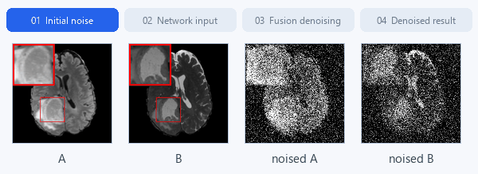
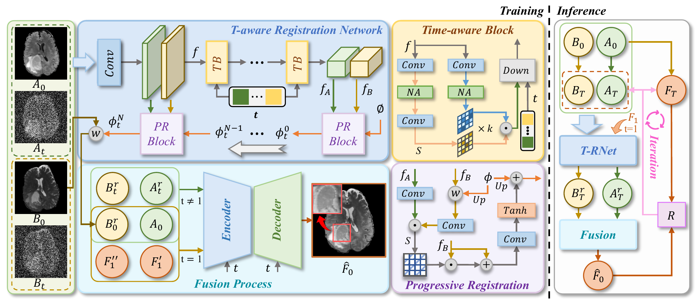
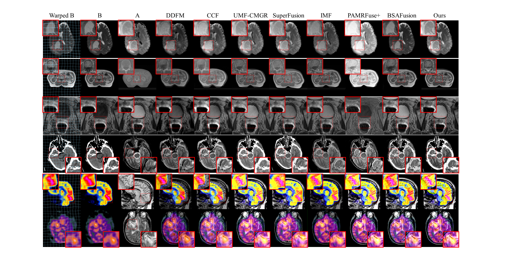
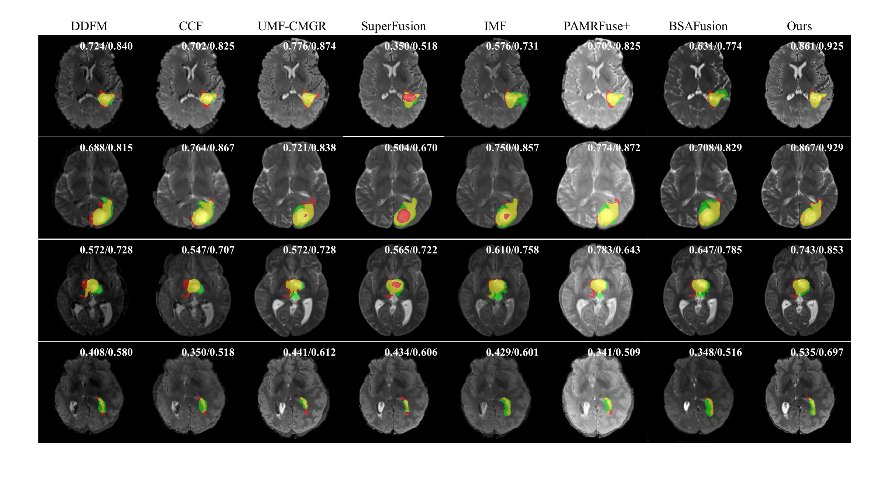
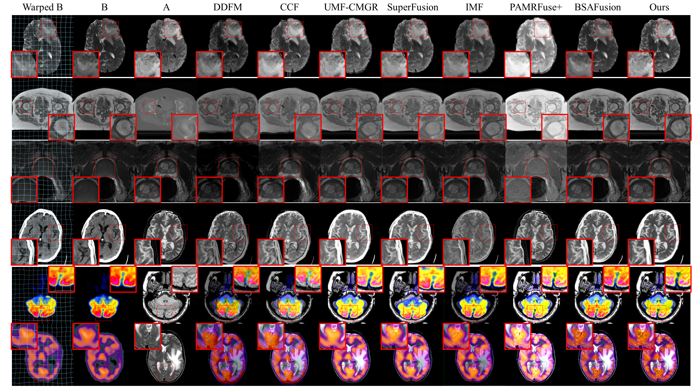

<div align="center">

<h2>Medical Image Fusion Driven by Implicit-Forward Diffusion<br>and Time-aware Joint Optimization</h2>

<p><strong>ResFusion &nbsp; | &nbsp; NeurIPS 2026</strong></p>

<p></p>

[](https://github.com/medcx/ResFusion)
[](https://drive.google.com/file/d/1i_Qt28X4c7QUhAvQKeSkB8eOJGSOIiGa/view?usp=sharing)
[](https://github.com/medcx/ResFusion)

[Overview](#overview) · [Method](#method) · [Quick Start](#quick-start) · [Results](#results) · [Citation](#citation)

</div>

---

## Overview

This repository contains the official implementation of **ResFusion: Medical Image Fusion Driven by Implicit-Forward Diffusion and Time-aware Joint Optimization**, presented at **NeurIPS 2026**.

ResFusion brings registration and medical image fusion into a joint framework, combining **implicit-forward diffusion**, **time-aware registration**, and **progressive alignment**.

## Method

<p align="center">
  <a href="assets/method.png"></a>
</p>

<p align="center"><em>Overview of ResFusion. Time-aware blocks and progressive registration align the input modalities within the iterative fusion process.</em></p>

## Quick Start

Run all commands from the repository root.

### 1. Prepare the checkpoint

Download the [ResFusion_BraTs](https://drive.google.com/file/d/1i_Qt28X4c7QUhAvQKeSkB8eOJGSOIiGa/view?usp=sharing), rename it to **`model_best.pth`**, and place it as follows:

```text
ResFusion/
├── configs/
│   ├── demo.yaml
│   └── fusion_brats.yaml
├── MyDatasets/
│   └── Demo/
├── demo_results/
│   └── model_best.pth
└── test_demo.py
```

### 2. Run the demo

The demo loads data from `MyDatasets/Demo`, as configured in `configs/demo.yaml`.

```bash
python test_demo.py
```


### 3. Train on BraTs

Update `data.train.params.dataset_path` and `data.val.params.dataset_path` in `configs/fusion_brats.yaml` to point to your local dataset. 

```bash
python main.py --cfg_path configs/fusion_brats.yaml --save_dir results/brats
```

## Results

### Fusion comparison

<p align="center">
  <a href="assets/fusion_comparison.png"></a>
</p>

<p align="center"><em>Qualitative comparison with DDFM, CCF, UMF-CMGR, SuperFusion, IMF, PAMRFuse+, and BSAFusion. Red boxes highlight local details; ResFusion is shown in the rightmost column.</em></p>

### Downstream segmentation

<p align="center">
  <a href="assets/segmentation_comparison.png"></a>
</p>

<p align="center"><em>Segmentation visualizations on fused images. Colored overlays and score annotations are reproduced from the original figure.</em></p>

<details>
<summary><strong>More fusion examples</strong></summary>

<p align="center">
  <a href="assets/fusion_additional.png"></a>
</p>

Additional examples using the same comparison methods. Red boxes indicate the regions enlarged for visual inspection.

</details>

*Click a figure to view it at full resolution.*

## Citation

If you find ResFusion useful in your research, please cite **Medical Image Fusion Driven by Implicit-Forward Diffusion and Time-aware Joint Optimization (NeurIPS 2026)**.

## Acknowledgments

Thank you for your interest in ResFusion. A star on [GitHub](https://github.com/medcx/ResFusion) is appreciated!
